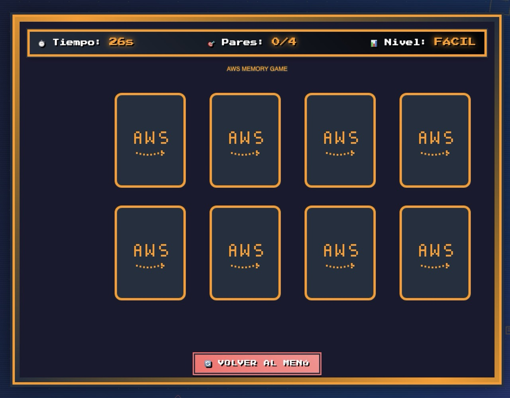
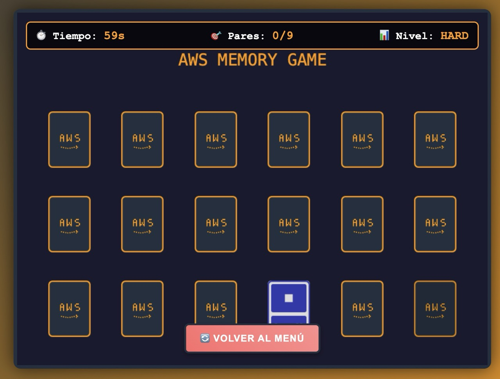

# AWS Memory Game 🎮

> 🇺🇸 **Do you prefer to read in English?** [**Click here for the English version**](README.md)

[](https://github.com/dvst/game-memory-aws-build-challenge/stargazers)
[](https://github.com/dvst/game-memory-aws-build-challenge/network)
[](https://github.com/dvst/game-memory-aws-build-challenge/issues)
[](https://github.com/dvst/game-memory-aws-build-challenge/blob/main/LICENSE)

## 🌟 Descripción

**AWS Memory Game** es un juego educativo de memoria con estilo retro 8-bits diseñado para ayudar a estudiantes, desarrolladores y profesionales a aprender y memorizar los servicios principales de Amazon Web Services (AWS) de manera divertida e interactiva.

### 🎯 Características Principales

- ✅ **Dos niveles de dificultad**: Fácil (8 cartas) y Difícil (18 cartas)
- ✅ **14 servicios AWS incluidos**: S3, Lambda, EC2, RDS, EKS, SageMaker, y más
- ✅ **Estilo retro auténtico**: Inspirado en consolas Nintendo de 8-bits
- ✅ **Música y efectos de sonido**: Generados programáticamente con Web Audio API
- ✅ **Multiidioma**: Soporte completo para Español e Inglés
- ✅ **Completamente gratuito**: Sin registro ni pagos requeridos
- ✅ **Responsive**: Compatible con desktop y dispositivos móviles
- ✅ **PWA Ready**: Instalable como aplicación web progresiva

## 🚀 Demo en Vivo

🎮 **[Jugar Ahora](http://aws-memory-game-javitech.s3-website-us-east-1.amazonaws.com)**

## 📱 Capturas de Pantalla


_Modo fácil con 8 cartas de servicios AWS básicos_


_Modo difícil con 18 cartas de servicios AWS avanzados_

## 🎓 Servicios AWS Incluidos

### Nivel Fácil (Servicios Básicos)

- **Amazon S3** - Simple Storage Service
- **AWS Lambda** - Funciones Serverless
- **Amazon EC2** - Elastic Compute Cloud
- **Amazon RDS** - Relational Database Service

### Nivel Difícil (Servicios Avanzados)

- **Amazon EKS** - Elastic Kubernetes Service
- **Amazon SageMaker** - Plataforma de Machine Learning
- **Amazon Kinesis** - Servicio de Streaming de Datos
- **Amazon Redshift** - Data Warehouse
- **AWS CloudFormation** - Infraestructura como Código
- **Amazon ElastiCache** - Caché en Memoria
- **Amazon SNS** - Simple Notification Service
- **Amazon SQS** - Simple Queue Service
- **Amazon DynamoDB** - Base de Datos NoSQL
- **Amazon CloudWatch** - Monitoreo y Observabilidad

## 🛠️ Tecnologías Utilizadas

- **Frontend**: HTML5, CSS3, JavaScript ES6+
- **Motor de Juego**: Phaser.js 3.70.0
- **Audio**: Web Audio API
- **Fuentes**: Press Start 2P (Google Fonts)
- **APIs**: GitHub API para estadísticas en tiempo real
- **PWA**: Service Workers, Web App Manifest
- **CI/CD**: GitHub Actions + AWS S3

## 📦 Instalación Local

```bash
# Clonar el repositorio
git clone https://github.com/dvst/game-memory-aws-build-challenge.git

# Navegar al directorio
cd game-memory-aws-build-challenge

# Abrir en navegador
open index.html
```

### Requisitos del Sistema

- Navegador web moderno (Chrome 60+, Firefox 55+, Safari 11+, Edge 79+)
- JavaScript habilitado
- Conexión a internet (opcional, para estadísticas de GitHub)

## 🎮 Cómo Jugar

1. **Selecciona tu idioma**: Español o Inglés
2. **Elige dificultad**: Fácil (4 pares) o Difícil (9 pares)
3. **Encuentra los pares**: Haz clic en las cartas para voltearlas
4. **Memoriza ubicaciones**: Recuerda dónde están los servicios
5. **Completa antes del tiempo**: ¡Gana encontrando todos los pares!

### Controles

- **Clic izquierdo**: Voltear carta
- **ESC**: Volver al menú principal
- **Botón de sonido**: Activar/desactivar audio

## 🎯 Beneficios Educativos

Este juego es perfecto para:

- 📚 **Estudiantes de Cloud Computing**
- 🏗️ **Arquitectos de Soluciones AWS**
- 💻 **Desarrolladores que inician en AWS**
- 🔧 **Profesionales DevOps**
- 📋 **Preparación para Certificaciones AWS**
- 🎓 **Cursos y Bootcamps de AWS**

## 🌐 SEO y Rendimiento

- ✅ **Optimizado para buscadores**: Meta tags, Open Graph, Schema.org
- ✅ **Core Web Vitals**: Carga rápida y experiencia fluida
- ✅ **PWA Compliant**: Instalable y funciona offline
- ✅ **Responsive Design**: Adaptado a todos los dispositivos
- ✅ **Accesibilidad**: Cumple estándares WCAG

## 🤝 Contribuir

¡Las contribuciones son bienvenidas! Por favor:

1. Fork el proyecto
2. Crea una rama para tu feature (`git checkout -b feature/AmazingFeature`)
3. Commit tus cambios (`git commit -m 'Add some AmazingFeature'`)
4. Push a la rama (`git push origin feature/AmazingFeature`)
5. Abre un Pull Request

### Ideas para Contribuir

- Agregar más servicios AWS
- Mejorar gráficos y animaciones
- Traducir a más idiomas
- Optimizar rendimiento
- Agregar nuevos modos de juego

## 📊 Estadísticas del Proyecto

- ⭐ **GitHub Stars**: 
- 🍴 **Forks**: 
- 📥 **Downloads**: 
- 🐛 **Issues**: 

## 🚀 Despliegue

Este proyecto utiliza GitHub Actions para despliegue automático en AWS S3. Ver [DEPLOYMENT.md](DEPLOYMENT.md) para instrucciones detalladas de configuración.

### Despliegue Rápido

1. Configurar bucket AWS S3
2. Configurar secrets en GitHub
3. Push a la rama main
4. Despliegue automático vía GitHub Actions

## 📄 Licencia

Este proyecto está bajo la Licencia MIT - ver el archivo [LICENSE](LICENSE) para más detalles.

## 👨‍💻 Autor

**DVST**

- Website: [JaviTech.co](https://javitech.co)
- GitHub: [@dvst](https://github.com/dvst)
- LinkedIn: [Javier Perez Puello](https://www.linkedin.com/in/javierperezp/)
- YouTube: [@javitech_co](https://youtube.com/@javitech_co?sub_confirmation=1)

## 🙏 Agradecimientos

- [Phaser.js](https://phaser.io/) - Excelente motor de juegos 2D
- [Google Fonts](https://fonts.google.com/) - Fuente Press Start 2P
- [AWS](https://aws.amazon.com/) - Por crear servicios increíbles
- Comunidad de desarrolladores que contribuyen al proyecto

## 📈 Roadmap

- [ ] Modo multijugador online
- [ ] Más servicios AWS (100+ servicios)
- [ ] Sistema de puntuaciones global
- [ ] Modo torneo
- [ ] Integración con AWS Educate
- [ ] Versión móvil nativa
- [ ] Soporte para más idiomas

---

⭐ **¡Si te gusta este proyecto, dale una estrella en GitHub!** ⭐

🎮 **[Jugar Ahora](http://aws-memory-game-javitech.s3-website-us-east-1.amazonaws.com)** | 📚 **[Documentación](https://github.com/dvst/game-memory-aws-build-challenge/wiki)** | 🐛 **[Reportar Bug](https://github.com/dvst/game-memory-aws-build-challenge/issues)**
