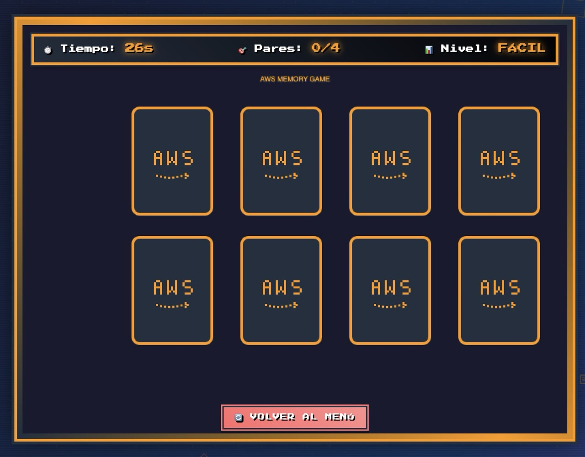
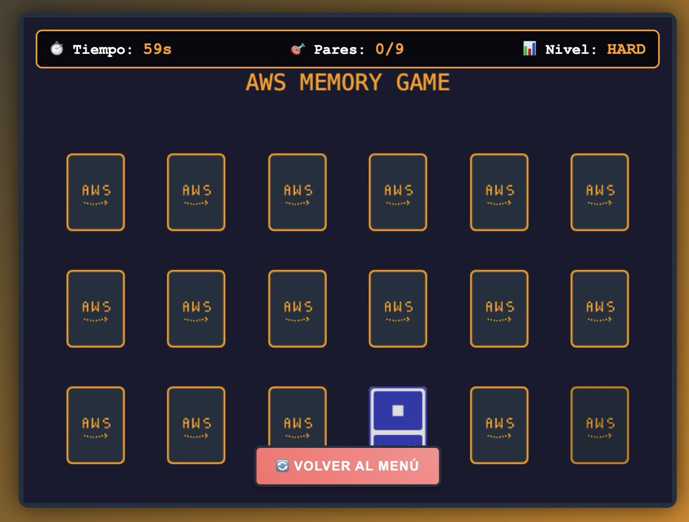

# AWS Memory Game 🎮

> 🇪🇸 **¿Prefieres leer en español?** [**Haz clic aquí para la versión en español**](README-ES.md)

[](https://github.com/dvst/game-memory-aws-build-challenge/stargazers)
[](https://github.com/dvst/game-memory-aws-build-challenge/network)
[](https://github.com/dvst/game-memory-aws-build-challenge/issues)
[](https://github.com/dvst/game-memory-aws-build-challenge/blob/main/LICENSE)

## 🌟 Description

**AWS Memory Game** is an educational 8-bit retro-style memory game designed to help students, developers, and professionals learn and memorize Amazon Web Services (AWS) core services in a fun and interactive way.

### 🎯 Key Features

- ✅ **Two difficulty levels**: Easy (8 cards) and Hard (18 cards)
- ✅ **14 AWS services included**: S3, Lambda, EC2, RDS, EKS, SageMaker, and more
- ✅ **Authentic retro style**: Inspired by 8-bit Nintendo consoles
- ✅ **Music and sound effects**: Programmatically generated with Web Audio API
- ✅ **Multilingual**: Full support for Spanish and English
- ✅ **Completely free**: No registration or payments required
- ✅ **Responsive**: Compatible with desktop and mobile devices
- ✅ **PWA Ready**: Installable as a progressive web app

## 🚀 Live Demo

🎮 **[Play Now](http://aws-memory-game-javitech.s3-website-us-east-1.amazonaws.com)**

## 📱 Screenshots


_Easy mode with 8 basic AWS services cards_


_Hard mode with 18 advanced AWS services cards_

## 🎓 AWS Services Included

### Easy Level (Basic Services)

- **Amazon S3** - Simple Storage Service
- **AWS Lambda** - Serverless Functions
- **Amazon EC2** - Elastic Compute Cloud
- **Amazon RDS** - Relational Database Service

### Hard Level (Advanced Services)

- **Amazon EKS** - Elastic Kubernetes Service
- **Amazon SageMaker** - Machine Learning Platform
- **Amazon Kinesis** - Data Streaming Service
- **Amazon Redshift** - Data Warehouse
- **AWS CloudFormation** - Infrastructure as Code
- **Amazon ElastiCache** - In-Memory Caching
- **Amazon SNS** - Simple Notification Service
- **Amazon SQS** - Simple Queue Service
- **Amazon DynamoDB** - NoSQL Database
- **Amazon CloudWatch** - Monitoring & Observability

## 🛠️ Technologies Used

- **Frontend**: HTML5, CSS3, JavaScript ES6+
- **Game Engine**: Phaser.js 3.70.0
- **Audio**: Web Audio API
- **Fonts**: Press Start 2P (Google Fonts)
- **APIs**: GitHub API for real-time statistics
- **PWA**: Service Workers, Web App Manifest
- **CI/CD**: GitHub Actions + AWS S3

## 📦 Local Installation

```bash
# Clone the repository
git clone https://github.com/dvst/game-memory-aws-build-challenge.git

# Navigate to directory
cd game-memory-aws-build-challenge

# Open in browser
open index.html
```

### System Requirements

- Modern web browser (Chrome 60+, Firefox 55+, Safari 11+, Edge 79+)
- JavaScript enabled
- Internet connection (optional, for GitHub statistics)

## 🎮 How to Play

1. **Select your language**: Spanish or English
2. **Choose difficulty**: Easy (4 pairs) or Hard (9 pairs)
3. **Find the pairs**: Click on cards to flip them
4. **Memorize locations**: Remember where the services are
5. **Complete before time runs out**: Win by finding all pairs!

### Controls

- **Left click**: Flip card
- **ESC**: Return to main menu
- **Sound button**: Toggle audio on/off

## 🎯 Educational Benefits

This game is perfect for:

- 📚 **Cloud Computing Students**
- 🏗️ **AWS Solutions Architects**
- 💻 **Developers starting with AWS**
- 🔧 **DevOps Professionals**
- 📋 **AWS Certification Preparation**
- 🎓 **AWS Courses and Bootcamps**

## 🌐 SEO and Performance

- ✅ **Search engine optimized**: Meta tags, Open Graph, Schema.org
- ✅ **Core Web Vitals**: Fast loading and smooth experience
- ✅ **PWA Compliant**: Installable and works offline
- ✅ **Responsive Design**: Adapted to all devices
- ✅ **Accessibility**: Meets WCAG standards

## 🤝 Contributing

Contributions are welcome! Please:

1. Fork the project
2. Create a feature branch (`git checkout -b feature/AmazingFeature`)
3. Commit your changes (`git commit -m 'Add some AmazingFeature'`)
4. Push to the branch (`git push origin feature/AmazingFeature`)
5. Open a Pull Request

### Ideas for Contributing

- Add more AWS services
- Improve graphics and animations
- Translate to more languages
- Optimize performance
- Add new game modes

## 📊 Project Statistics

- ⭐ **GitHub Stars**: 
- 🴠**Forks**: 
- 📥 **Downloads**: 
- 🛠**Issues**: 

## 🚀 Deployment

This project uses GitHub Actions for automatic deployment to AWS S3. See [DEPLOYMENT.md](DEPLOYMENT.md) for detailed setup instructions.

### Quick Deploy

1. Configure AWS S3 bucket
2. Set up GitHub secrets
3. Push to main branch
4. Automatic deployment via GitHub Actions

## 📄 License

This project is licensed under the MIT License - see the [LICENSE](LICENSE) file for details.

## 👨‍💻 Author

**DVST**

- Website: [JaviTech.co](https://javitech.co)
- GitHub: [@dvst](https://github.com/dvst)
- LinkedIn: [Javier Perez Puello](https://www.linkedin.com/in/javierperezp/)
- YouTube: [@javitech_co](https://youtube.com/@javitech_co?sub_confirmation=1)

## 🙏 Acknowledgments

- [Phaser.js](https://phaser.io/) - Excellent 2D game engine
- [Google Fonts](https://fonts.google.com/) - Press Start 2P font
- [AWS](https://aws.amazon.com/) - For creating amazing services
- Developer community contributing to the project

## 📈 Roadmap

- [ ] Online multiplayer mode
- [ ] More AWS services (100+ services)
- [ ] Global leaderboard system
- [ ] Tournament mode
- [ ] AWS Educate integration
- [ ] Native mobile version
- [ ] Support for more languages

---

⭐ **If you like this project, give it a star on GitHub!** ⭐

🎮 **[Play Now](http://aws-memory-game-javitech.s3-website-us-east-1.amazonaws.com)** | 📚 **[Documentation](https://github.com/dvst/game-memory-aws-build-challenge/wiki)** | 🐛 **[Report Bug](https://github.com/dvst/game-memory-aws-build-challenge/issues)**
